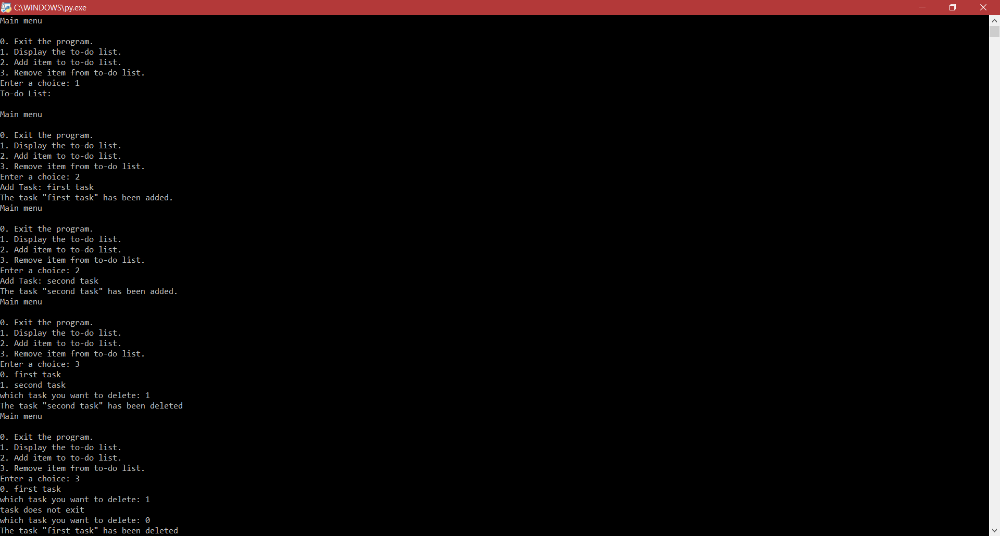

# To-Do-List-python

This is my first application using Python Language
I was trying to self-learn Python language, so I came up with To-do List app.

It has the ability to show, add or remove tasks from the list.

